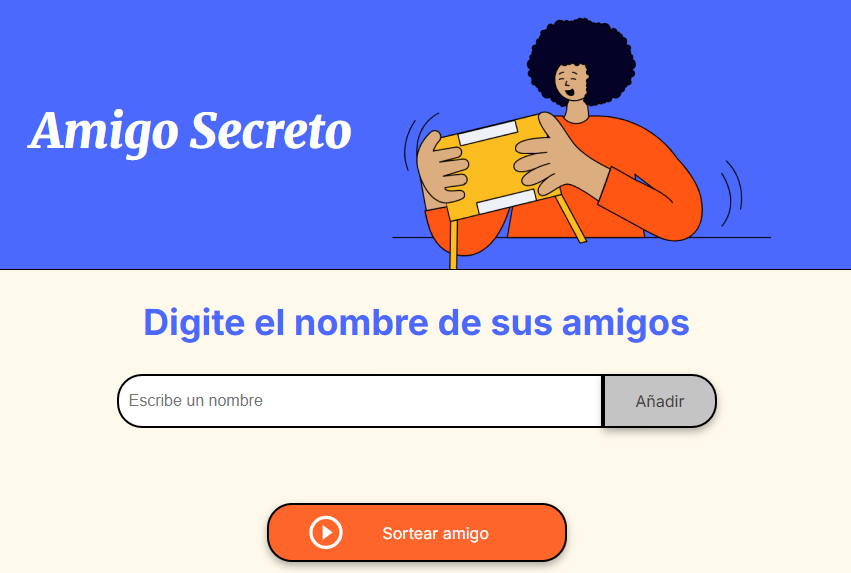

# 🎁 Sorteo del Amigo Secreto

Aplicación web que permite realizar un sorteo justo y sin repeticiones entre una lista de participantes. Ideal para organizar dinámicas de Amigo Secreto de forma rápida y divertida.

---

## ⚙️ Funcionalidades

- ✅ **Agregar nombres**: Campo de texto para ingresar participantes.
- 🚫 **Validar entrada**: Evita agregar campos vacíos.
- 📋 **Visualizar lista**: Muestra los nombres ingresados en pantalla.
- 🎲 **Sorteo aleatorio sin repeticiones**: Selecciona un nombre que no haya sido sorteado antes.
- 🏁 **Finalización automática**: Muestra un mensaje cuando todos los nombres han sido sorteados.

---

## 🧪 Cómo probar el proyecto localmente

> 📝 *Esta sección puede eliminarse si no se desea incluirla.*

1. Clona o descarga el repositorio.
2. Abre el archivo `index.html` en tu navegador.
3. Ingresa nombres en el campo de texto.
4. Presiona “Agregar” y luego “Sortear” para comenzar.

---

## 🐞 Errores comunes

- ❌ **No se ingresó ningún nombre**  
  *Solución:* Asegúrate de escribir un nombre antes de presionar “Agregar”.

- 🔁 **Se repiten nombres en el sorteo**  
  *Solución:* El código evita repeticiones usando un historial de índices. Verifica que estés usando la versión actualizada.

- 📭 **No se muestra el nombre sorteado**  
  *Solución:* Revisa que el HTML incluya el elemento con `id="resultado"` correctamente.

---

## 📁 Estructura del repositorio

Sorteo-Amigo-Secreto/ ├── index.html ├── script.js └── README.md

---

## 🖼️ Vista previa del proyecto

---

## 👤 Desarrollador

Creado por **Navros Fabian**  
🔗 [GitHub: navrosfabian](https://github.com/navrosfabian)

---

## 📄 Licencia

Este proyecto puede ser modificado y adaptado libremente. Se recomienda mantener los créditos si se reutiliza públicamente.
